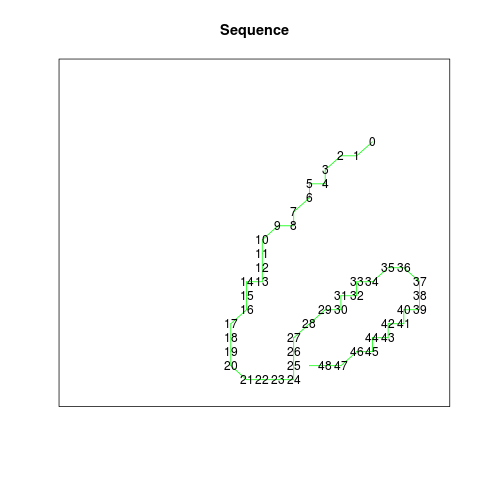
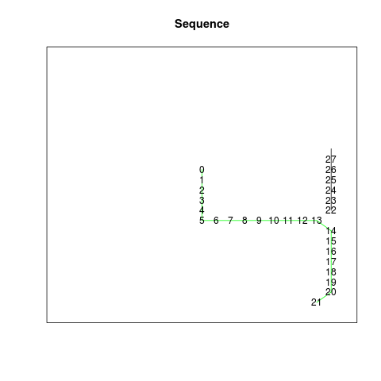
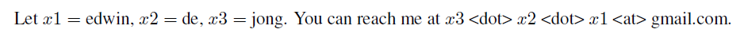

# mnist-digits-stroke-sequence-data
The MNIST handwritten digit images transformed into a data set for sequence learning. This data set contains pen stroke sequences based on the original MNIST images.

## Examples

Input image (MNIST training image no. 13):

Thresholded:

Thinned:
 

Sequence (positive y direction is downward): 

|dx|dy|eos|eod|
|---:|:----:|:---|:---|
|18|4|0|0|
|-1|1|0|0|
|-1|0|0|0|
|-1|1|0|0|
|0|1|0|0|
|-1|0|0|0|
|0|1|0|0|
|-1|1|0|0|
|0|1|0|0|
|-1|0|0|0|
|.|.|.|.|

The complete sequence for this example is available [here](https://github.com/edwin-de-jong/mnist-digits-as-stroke-sequences/blob/master/fig/trainimg-13-inputdata.txt)

And an example that requires two strokes:

Input image (MNIST training image no. 58):

Thresholded:

Thinned:
 

[Sequence](https://github.com/edwin-de-jong/mnist-digits-as-stroke-sequences/blob/master/fig/trainimg-58-inputdata.txt) : 

The data set aims to provide a consistent set of sequences, meaning that similar images should result in similar sequences. The choices made by the algorithm will sometimes differ from the choices made by humans who write digits; training sequence 58 provides an example.
After the downward and rightward stroke, the TSP algorithm prefers to continue with the downward stroke, and then draw the remaining upper part of the rightmost line in the upward direction. Most humans would probably stop instead, and draw the rightmost line as a single stroke in one go. This reflects differences in the criteria or preferences that are optimized in selecting between different options. For the purpose of providing a consistent data set for sequence learning, any set of criteria used to guide these choices could be used in principle, as long the choices are made consistently and as long as the complexity of the resulting sequences is minimized. 

## Sequence learning benchmark

This sequence learning dat set can be used for at least two different types of sequence learning challenges:

## Code

The code that was used to create this data set is available [here](https://github.com/edwin-de-jong/mnist-digits-as-stroke-sequences)

## Terms of Use
Edwin D. de Jong holds the copyright of the MNIST stroke sequence data set, which is a derivative work of the MNIST dataset. Yann LeCun (Courant Institute, NYU) and Corinna Cortes (Google Labs, New York) hold the copyright of the MNIST dataset, which is a derivative work from original NIST datasets. The MNIST stroke sequence dataset is made available under the terms of the [Creative Commons Attribution-Share Alike 3.0 license](https://creativecommons.org/licenses/by-sa/3.0/).

## Contact

Please feel free to contact me for any questions or comments. My email is the 3 parts of my name in *reverse order*:

